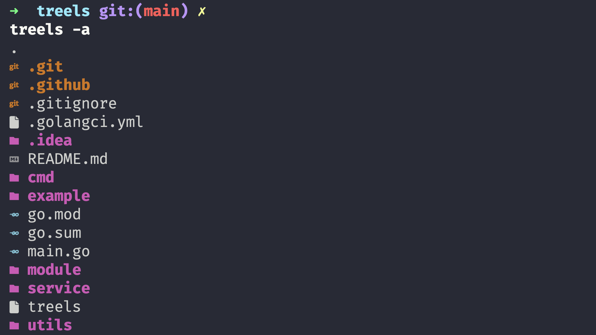
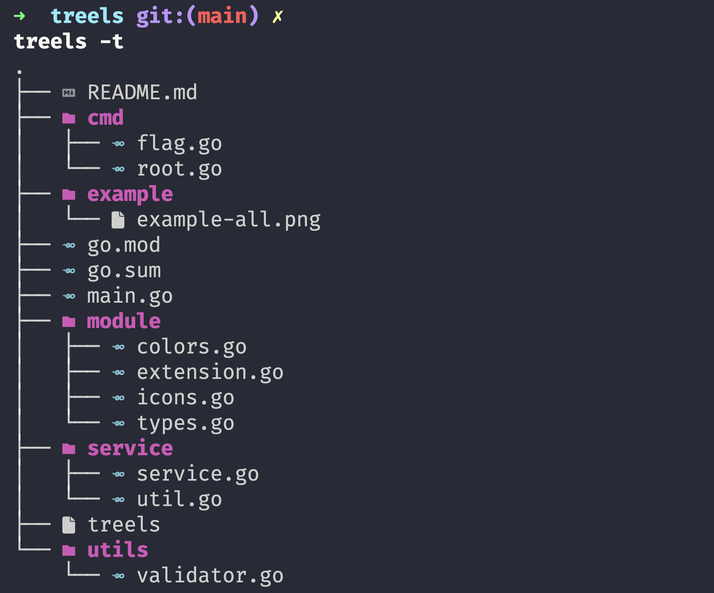

# ⚡ treels
Treels, a CLI tool built in Go, merges the tree and ls commands while introducing intuitive merging and beautification features, 
simplifying directory navigation and enhancing the command-line experience.

## 🚀 Installation

To install the `treels` command-line tool, ensure you have Go installed on your system. If not, you can download and install it from the [official Go website](https://golang.org/dl/).

Once you have Go installed, open a terminal or command prompt and run the following command:

```bash
go install github.com/oussamaM1/treels/
```

This command will download the repository, build the `treels` executable, and place it in your Go binary directory. Make sure your Go binary directory is in your system's PATH so that you can execute `treels` from any directory.

## 📝 Note

To ensure that icons are displayed correctly in the terminal, it's recommended to use Nerd fonts. For example, you can download the FiraCode Nerd Font from [here](https://github.com/ryanoasis/nerd-fonts/releases/download/v3.2.0/FiraCode.zip).

## ⚡ Usage

```bash
treels [Flags] [Path]
```

## 🏷️ Flags

- `-a, --all`: List all files and directories
- `-h, --help`: Help for treels
- `-t, --tree`: Tree view of the directory

## 📋 Example

```bash
treels -a
```

This command will list all files and directories in the `current` directory.



```bash
treels -t /Project/treels
```

This command will display the tree view of the `/Project/treels/` directory.


