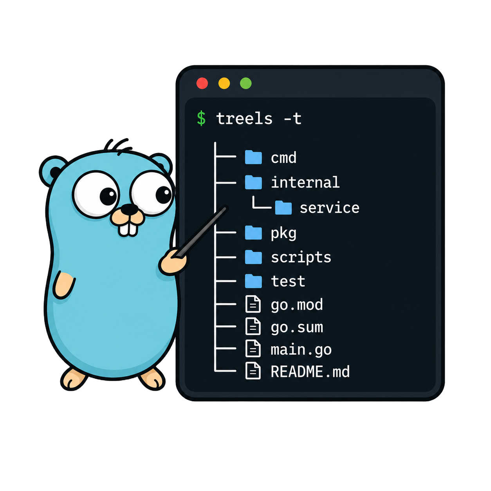

# treels

[](https://github.com/OussamaM1/treels/actions/workflows/go.yml)
[](https://codecov.io/gh/OussamaM1/treels)

`treels` is a Go CLI that blends the quick scan of `ls` with the structure of `tree`.
Use it to inspect directories as a compact grid, expand them as a tree, hide project noise with
`.gitignore`, show detailed metadata, and keep large repositories readable with depth limits.

<p align="center">
  
</p>

## Quick start

```bash
treels                         # compact ls-style view
treels --tree                  # recursive tree view
treels --tree --depth 2        # tree view limited to two levels
treels --tree --gitignore      # exclude root .gitignore matches
treels --tree --dirs-only      # show directory structure only
treels --long --readable       # detailed listing with readable sizes
treels --json                  # machine-readable output
treels --no-icons              # fallback for terminals without Nerd Fonts
```

> [!NOTE]
> File and folder icons look best with a Nerd Font installed. If your terminal does not support
> Nerd Font glyphs, use `--no-icons`.

## Installation

### With Go

```bash
go install github.com/oussamaM1/treels@latest
```

Make sure your Go binary directory is in your `PATH`. You can check where Go installs binaries with:

```bash
go env GOPATH
```

The binary is usually placed in:

```text
$(go env GOPATH)/bin
```

### From source

```bash
git clone https://github.com/OussamaM1/treels.git
cd treels
go build .
./treels --version
```

## Features

| Feature | Flag |
| --- | --- |
| Compact grid listing | default |
| Recursive tree view | `-t`, `--tree` |
| Depth limit | `--depth N` |
| Detailed metadata | `-l`, `--long` |
| Human-readable sizes | `-r`, `--readable` |
| JSON output | `--json` |
| Hidden files | `-a`, `--all` |
| Directory-only view | `--dirs-only` |
| Respect root `.gitignore` | `--gitignore` |
| Disable icons | `--no-icons` |
| Hide text summary | `--no-summary` |
| Version output | `-v`, `--version` |

## Usage

```bash
treels [flags] [path]
```

If no path is provided, `treels` lists the current directory.

For detailed usage examples and flag interactions, see [docs/usage.md](docs/usage.md).

## Preview

Examples below use `--no-icons` so output is readable in any terminal.

### Compact directory listing

```text
$ treels --no-icons file-icons-example
.
Dockerfile               Main.kt                  Program.cs
app.conf                 app.lock                 app.log
app.rb                   app.swift                backup.zip
c-file.c                 class-java-file.class    component.vue
config.xml               cpp-file.cpp             document.pdf
index.html               index.php                java-file.java
javascript-file.js       json-file.json           logo.png
main.tf                  package.json             plb-file.plb
pls-file.pls             python-file.py           react-component.jsx
react-typescript.tsx     rust-file.rs             script.sh
song.mp3                 sql-file.sql             styles.css
typescript-file.ts       video.mp4                yaml-file.yml

0 directories, 36 files
```

### Tree view with a depth limit

```text
$ treels --tree --depth 1 --gitignore --no-icons
.
├── LICENSE
├── README.md
├── cmd
├── docs
├── example
├── file-icons-example
├── go.mod
├── go.sum
├── main.go
├── module
├── service
└── utils

7 directories, 5 files
```

### Detailed listing

```text
$ treels --long --readable --no-icons service
.
-rw-r--r--      3.8 KB  2026-06-10  gitignore.go
-rw-r--r--      4.0 KB  2026-06-10  json.go
-rw-r--r--      7.1 KB  2026-06-10  service.go
-rw-r--r--     35.0 KB  2026-06-10  service_test.go
-rw-r--r--     18.0 KB  2026-06-10  util.go

0 directories, 5 files
```

## Documentation

- [Usage guide](docs/usage.md)
- [JSON output](docs/json-output.md)
- [Gitignore support](docs/gitignore.md)
- [Icons and fonts](docs/icons.md)
- [Development guide](docs/development.md)
- [Contributing](CONTRIBUTING.md)

## Development

```bash
go test ./...
go vet ./...
golangci-lint run
go build .
```

See [docs/development.md](docs/development.md) for more details.

## License

This project is licensed under the terms in [LICENSE](LICENSE).
